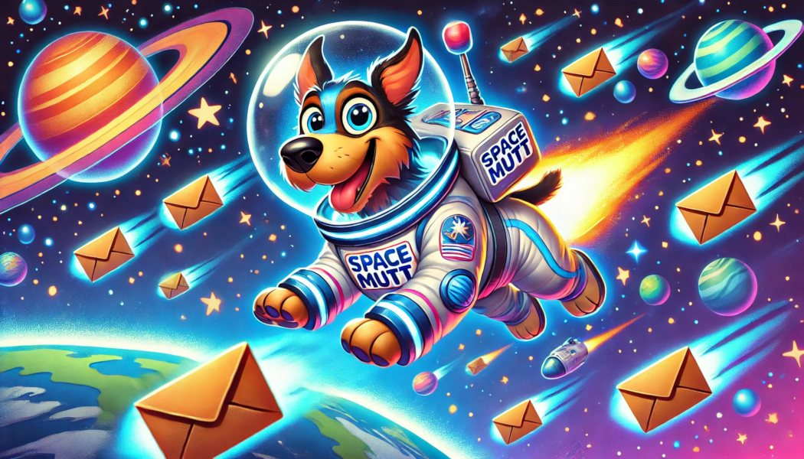

# This is the SpaceMutt Project
 

  

## What is SpaceMutt?

* SpaceMutt is TUI Email Client, a fork of [NeoMutt](https://neomutt.org/).

## Purpose of This Fork

- **Guile Scheme Integration**: Fully integrate Guile Scheme as the main configuration format.
- **Refactoring with GLib**: Conduct major refactoring to utilize [GLib](https://docs.gtk.org/glib/index.html) infrastructure, data types, and functions.
- **Code Cleanup**: Remove deprecated code for enhanced maintainability and performance.

This fork aims to enhance NeoMutt by leveraging the powerful features of Guile Scheme and GLib, improving both its configuration flexibility and internal code structure.

## Where is SpaceMutt?

- Source Code:     https://github.com/Junker/spacemutt
- Releases:        https://github.com/Junker/spacemutt/releases/latest
- Questions/Bugs:  https://github.com/Junker/spacemutt/issues

## Copyright

SpaceMutt is released under the GPL v2+ (GNU General Public License).
See [LICENSE.md](LICENSE.md).
